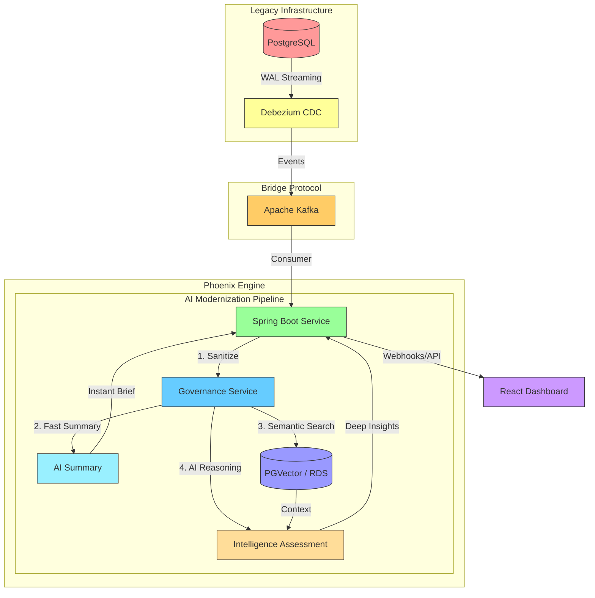

# Phoenix // Intelligence Engine

> **Modernizing Legacy Insurance at the Speed of Light.**  
> A high-performance, real-time insurance claims modernization platform powered by Event-Driven Architecture and Generative AI.

Phoenix is a next-generation intelligence engine designed to revolutionize the insurance claims lifecycle. By leveraging real-time Change Data Capture (CDC), high-throughput messaging, and Retrieval-Augmented Generation (RAG), Phoenix transforms raw claim data into actionable insights, automated summaries, and sophisticated fraud risk assessments within seconds of a database commit.

---

## I. Executive Summary

### 🚩 The Problem
The legacy insurance monolith was a **"black box."** Data was trapped in an aging on-premise PostgreSQL database, and manual claim reviews took an average of **4 days**. Adjusters were overwhelmed with raw text, leading to missed fraud indicators and delayed payouts.

### ✨ The Solution
Phoenix is an **AI-Native Sidecar** implementation using the **Strangler Fig pattern**. It provides real-time semantic search and automated summaries by transparently tapping into the legacy database via CDC—without touching a single line of legacy code, providing real-time semantic overlays and automated risk scoring.

### 📈 Estimated Business Impact
*   **70% Reduction** in manual review time (from 4 days to ~30 seconds).
*   **99.9% Data Visibility** across all claim cycles without a system downtime.
*   **Modernized Compliance**: Automated PII masking for HIPAA/GDPR readiness.

---

## II. 🚀 Core Capabilities

### ⚡ Real-Time Data Modernization
Utilizing PostgreSQL Write-Ahead Logs (WAL) and Debezium, Phoenix captures every transaction at the source. These events are streamed through **Apache Kafka**, enabling a reactive processing pipeline that moves data from legacy systems to intelligence layers with sub-second latency.

### 🧠 Intelligent Fraud Detection RAG
Unlike traditional static rule engines, Phoenix employs **Retrieval-Augmented Generation (RAG)**. Every new claim is vectorized and cross-referenced against a historical corpus stored in high-performance Vector Databases (**PGVector** or **Weaviate**). This allows the AI to detect patterns, duplicate filings, and anomalies by "remembering" years of historical context.

### � Enterprise-Grade Observability
Phoenix is built for production reliability. It features native **OpenTelemetry (OTel)** integration, providing a unified telemetry stream for:
*   **Distributed Tracing**: Visualizing the entire journey of a claim through the pipeline with **Jaeger**.
*   **Performance Metrics**: High-fidelity JVM and system metrics via **Prometheus** and **Grafana**.
*   **Structured Logging**: Context-aware logs that link directly to trace spans for rapid debugging.

---

## III. Visual Architecture



---

## IV. Deep Dive: Engineering Excellence

### 🧵 High-Concurrency Processing (Project Loom)
To handle intensive LLM API calls and vector searches without blocking high-throughput Kafka consumers, Phoenix utilizes **Java 21 Virtual Threads**. This allows thousands of concurrent AI enrichment sessions on minimal hardware.

```java
// application.properties
spring.threads.virtual.enabled=true  // Virtual Threads enabled for massive AI concurrency
```

### 🔍 Retrieval-Augmented Generation (RAG)
Every incoming claim is vectorized and cross-referenced against the `pgvector` store. The AI reasons based on evidence from historical data.

```java
// Snippet from ClaimModernizationService.java
fetchedClaims = vectorStoreManager.getStore(claimProvider)
        .similaritySearch(SearchRequest.builder()
                .query(sanitizedDescription)
                .topK(3)
                .build());
```

### 🧠 The Intelligence Assessment: How it Works
The "Intelligence Assessment" is the transition from simple data processing to actual semantic reasoning. This 4-step orchestration happens in milliseconds:

1.  **Contextual Retrieval**: The system performs a similarity search in `PGVector`, identifying the top 3 historical claims most relevant to the current event.
2.  **Prompt Orchestration**: A dense context packet is built, combining the sanitized current claim with its historical "shadows" (similar past events).
3.  **Reasoning Engine**: The LLM acts as a **Digital Adjuster**, analyzing timing inconsistencies, overlapping claimant details, and pattern anomalies.
4.  **Structured Synthesis**: The AI generates a machine-readable score (0-100), a concise analysis, and a technical rationale, which is then parsed and projected to the React dashboard.

---

## V. FinOps & Security

### 💰 Cost Control (FinOps)
AI tokens are expensive. Phoenix optimizes spend by implementing a **Multi-Stage Processing pipeline**:
1.  **Stage 1 (Fast Summary)**: Uses tiny, cost-effective models (e.g., `tinyllama`) for immediate categorization.
2.  **Stage 2 (Deep Analysis)**: Only triggers expensive RAG/Reasoning models (e.g., `gemini-1.5-pro`) for high-value or suspect claims.

### 🛡 Data Privacy (Governance Gate)
Before data reaches an LLM, it passes through our **Governance Service**. **In development, this service provides a foundational subset of protections.** In **Production**, this gateway will be fully enforced with comprehensive high-performance regex and NER (Named Entity Recognition) engines to redact SSNs, policy IDs, and emails, ensuring PII never leaves the secure VPC boundary.

```java
@Service
public class GovernanceService {
    private static final Pattern SSN_PATTERN = Pattern.compile("\\b\\d{3}-\\d{2}-\\d{4}\\b");

    public String redactSensitiveData(String input) {
        return SSN_PATTERN.matcher(input).replaceAll("[REDACTED_SSN]");
    }
}
```

---

## 🛠 Getting Started

### Local Development (Ollama + PGVector)
```bash
docker-compose --profile local up -d
```

### Cloud Deployment (AWS RDS + Gemini)
Phoenix is production-hardened for AWS, featuring CloudFormation templates for VPC, RDS (with PGVector extension), and auto-scaling backend services.

---

*Built for the next generation of insurance intelligence.*
